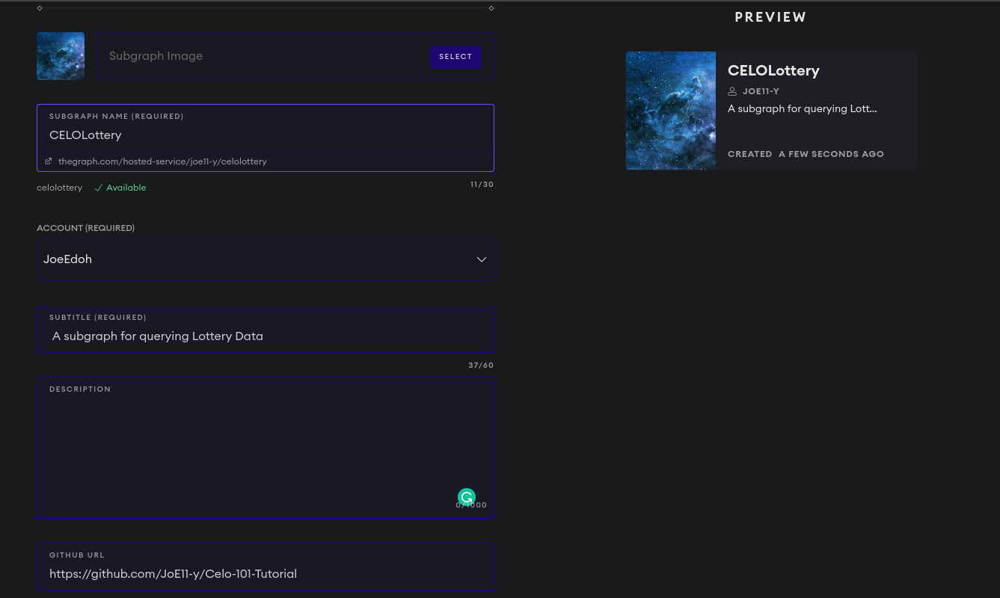
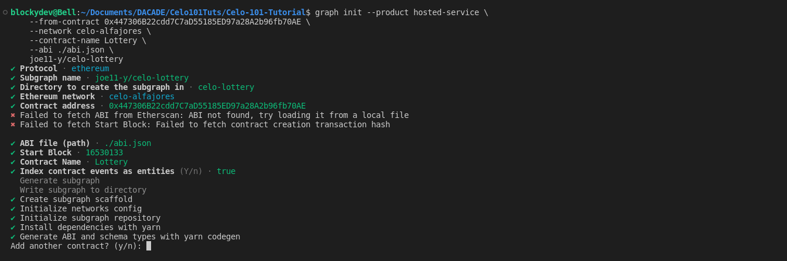
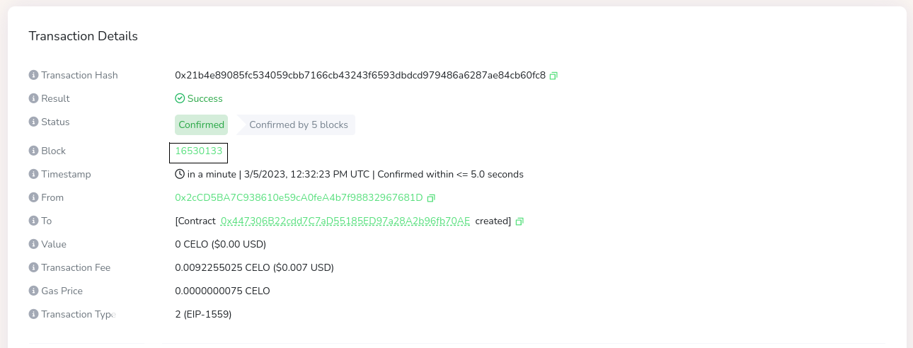
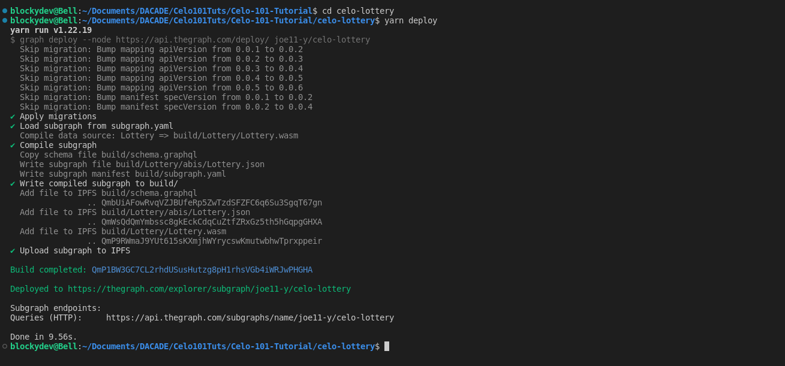
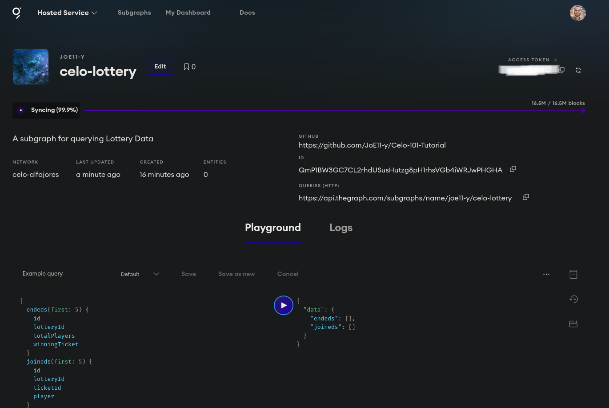
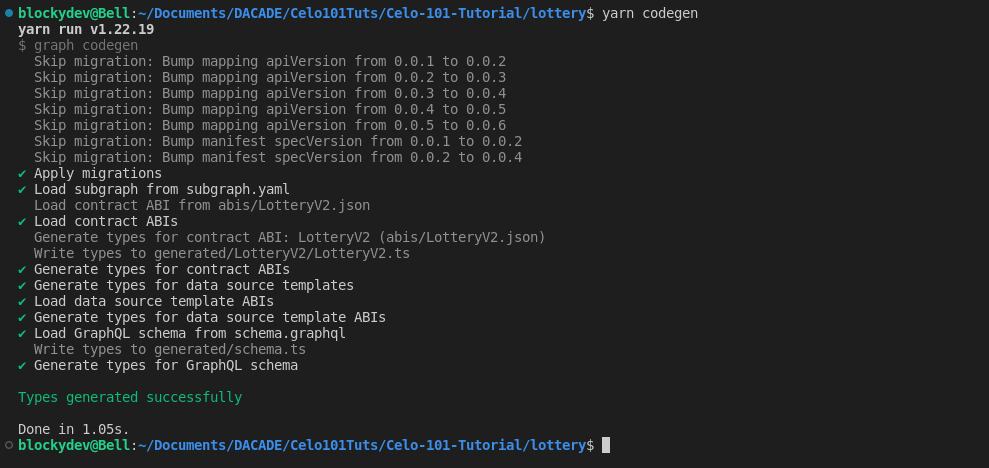
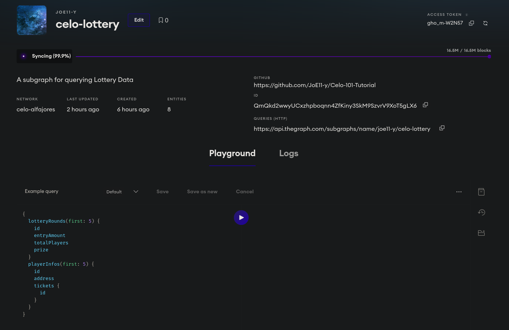
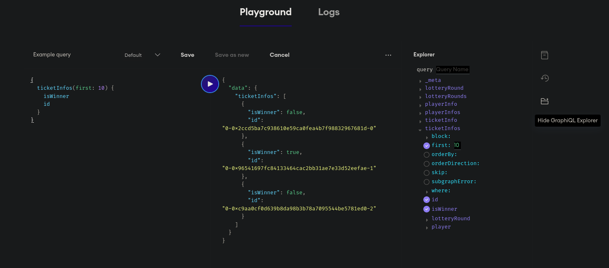

# Using the Graph to Index Transactions

## Introduction

For most apps built on blockchains like Ethereum and other EVM-based chains, it's hard and time-intensive to read data directly from the chain, so you used to see people and companies building their own centralized indexing servers and serving API requests from these servers. This requires a lot of engineering and hardware resources and breaks the security properties required for decentralization.

This tutorial will focus on us building an API on top of blockchain data that can easily be deployed to a decentralized web infrastructure. The protocol we'll be working with is called the Graph

The Graph is an indexing protocol for querying blockchains like Ethereum and networks like IPFS. Anyone can build and publish open APIs, called subgraphs, making data easily accessible.

Subgraphs are made up of a few main parts:

1. GraphQL Schema: This defines the data types/entities you would like to save and query for. You can also define configurations like relationships and full-text search capabilities in your schema.

2. Subgraph Manifest (yaml configuration): (from the docs) The manifest defines the smart contracts your subgraph indexes, their ABIs, which events from these contracts to pay attention to, and how to map event data to entities that Graph Node stores and allows querying.

3. AssemblyScript Mappings: This allows you to save data to be indexed using the entity types defined in your schema. This is written in TypeScript which is then compiled into AssemblyScript.


### Table Of Contents
- [Using the Graph to Index Transactions](#using-the-graph-to-index-transactions)
  - [Introduction](#introduction)
    - [Table Of Contents](#table-of-contents)
  - [Prerequisites](#prerequisites)
  - [Requirements](#requirements)
  - [Tutorial](#tutorial)
    - [STEP 1: Creating the Subgraph](#step-1-creating-the-subgraph)
    - [STEP 2: Initializing And Deploying the Subgraph](#step-2-initializing-and-deploying-the-subgraph)
    - [STEP 3: Creating new queries](#step-3-creating-new-queries)
  - [Conclusion](#conclusion)

## Prerequisites

- Basics of programming with JavaScript and [Typescript](https://www.typescriptlang.org/).
- Basic knowledge of programming with [Solidity](https://soliditylang.org/)
- Basic knowledge of how to use the Remix IDE
- Basic knowledge of using the command line

## Requirements

- Have [Node.js](https://nodejs.org/en/) installed from version V10. or higher
- NPM or Yarn Installed.

## Tutorial

### STEP 1: Creating the Subgraph

There are two ways to create a new subgraph. We can either choose to make it from an example subgraph, or from an existing smart contract.

In this tutorial, we'll be creating a subgraph from an existing smart contract. The smart contract we'll use is the Lottery smart contract gotten from another tutorial on this platform [Kishore Tutorial Lottery SmartContract](https://dacade.org/communities/celo/courses/celo-tut-101/challenges/2f141e8b-104a-4b29-9a23-44f424b52695/submissions/cd82d935-1b47-4381-9133-60cb0d379fb1). More information about the contract is on the submission page, so if you're feeling out of depth you can choose to pause here and go over Kishore's Tutorial.

Note: I updated the events, so I could use them to parse out more information for the subgraph APIs.

```solidity
// SPDX-License-Identifier: MIT
pragma solidity ^0.8.0;

// if compiling on hardhat or truffle
// import "witnet-solidity-bridge/contracts/interfaces/IWitnetRandomness.sol";

//if compiling on remix
import "https://github.com/witnet/witnet-solidity-bridge/contracts/interfaces/IWitnetRandomness.sol";


contract LotteryV2 {
    //Address of the witnet randomness contract in Celo Alfajores testnet
    address witnetAddress = 0xbD804467270bCD832b4948242453CA66972860F5;
    IWitnetRandomness public witnet = IWitnetRandomness(witnetAddress);

    // The price to enter the lottery
    uint256 public entryAmount;

    uint256 public lastWinnerAmount;
    uint256 public lotteryId;
    uint256 public latestRandomizingBlock;

    address payable public lastWinner;
    address[] public players;
    address public owner;

    bool public open;

    constructor() {
        owner = msg.sender;
    }

    modifier onlyOwner() {
        require(msg.sender == owner, "not owner");
        _;
    }

    //Checks if there is a current active lottery
    modifier onlyIfOpen() {
        require(open, "Not Open");
        _;
    }

    event Started(uint lotteryId, uint entryAmount);
    event Joined(uint lotteryId, uint ticketId, address player);
    event Ended(
        uint lotteryId,
        uint totalPlayers,
        uint winningTicket,
        uint winningAmount,
        address winner
    );

    error reEntry();

    function start(uint32 _entryAmount) external onlyOwner {
        //Check if there is a current active lottery
        require(!open, "running");

        // Convert the default wei input to celo
        entryAmount = _entryAmount * 1 ether;

        open = true;

        // Deleting the previous arrays of players
        delete players;

        emit Started(lotteryId, _entryAmount);
        lotteryId++;
    }

    function join() external payable onlyIfOpen {
        require(msg.value == entryAmount, "Insufficient Funds");

        //Check if user is already a player
        for (uint i = 0; i < players.length; i++) {
            if (msg.sender == players[i]) {
                revert reEntry();
            }
        }
        players.push(msg.sender);

        emit Joined(lotteryId - 1, players.length - 1, msg.sender);
    }

    function requestRandomness() external onlyOwner onlyIfOpen {
        latestRandomizingBlock = block.number;

        //Setting the fee to 1 celo
        uint feeValue = 1 ether;
        witnet.randomize{value: feeValue}();
    }

    function pickWinner() external onlyOwner onlyIfOpen {
        // Check if the requestRandomness was called to generate the randomness
        assert(latestRandomizingBlock > 0);

        uint32 range = uint32(players.length);
        uint winnerIndex = witnet.random(range, 0, latestRandomizingBlock);

        lastWinner = payable(players[winnerIndex]);
        lastWinnerAmount = address(this).balance;

        (bool sent, ) = lastWinner.call{value: lastWinnerAmount}("");
        require(sent, "Failed to send reward");

        open = false;
        latestRandomizingBlock = 0;

        emit Ended(
            lotteryId - 1,
            players.length,
            winnerIndex,
            lastWinnerAmount,
            lastWinner
        );
    }

    receive() external payable {}
}


```

To get started, go to [The Graph's Hosted Service](https://thegraph.com/hosted-service) and log in using your GitHub account, and visit the **Dashboard tab**.

Next, go to the dashboard and click on ***Add Subgraph*** to create a new subgraph.


:placard: Take note of your Access Token

Configure your subgraph with the following properties:

```text
    Subgraph Name - celo-lottery
    Subtitle - A subgraph for querying Lottery Data
    Optional - Fill the description and GITHUB URL properties
```



Once the subgraph is created, we will initialize the subgraph locally using the Graph CLI.

### STEP 2: Initializing And Deploying the Subgraph

To set up the Graph CLI create a new folder `Lottery` from the terminal.

Next, inside this folder install the Graph CLI:

```bash
$ npm install -g @graphprotocol/graph-cli

# or

$ yarn global add @graphprotocol/graph-cli
```

Once the Graph CLI is installed, create an `abi.json` file (this is needed to initialize the graph), compile the contract on [Remix](https://remix.ethereum.org/#optimize=false&runs=200&evmVersion=null&version=soljson-v0.8.7+commit.e28d00a7.js&lang=en) and copy the abi into this file. An already compiled version of the contract can be found [here](https://github.com/JoE11-y/Celo-101-Tutorial/blob/main/abi.json), you can also copy it from there.

A deployed version of this contract exists @ [0x0A886c0749a129724BB712C451897d9B688CEA8c](https://explorer.celo.org/alfajores/address/0x0A886c0749a129724BB712C451897d9B688CEA8c/contracts#address-tabs)

Now on the terminal execute this command to initialize the subgraph

```bash
$ graph init --product hosted-service \
    --from-contract 0x0A886c0749a129724BB712C451897d9B688CEA8c \
    --network celo-alfajores \
    --contract-name LotteryV2 \
    --abi ./abi.json \
    joe11-y/celo-lottery \
    lottery
```

The CLI tool will prompt you for some additional information. Just enter as it is using the preset values for the arguments. Now for the subgraph name, enter your GitHub username followed by the name of your project. In my case, this is `joe11-y/celo-lottery`.



Now chances the CLI fails to fetch the ABI and the start Block of the Contract are high, so you may have to respecify when queried about the `ABI file (path)` and the block number. The ABI file path is already known in this case as `./abi.json`, while the start `block number` can be gotten from the [celo explorer](https://explorer.celo.org/alfajores/tx/0xadb031bb35a9bf528060cdaf8730326e2605ad9440ef6591ce7e115fa50655d5) for the contract creation.



The tool sets up the subgraph in the specified directory `lottery`.

Next is to authenticate the subgraph with the access token, so head over to the dashboard and copy the access token, then run this command on your terminal.

```bash
graph auth --product hosted-service <ACCESS_TOKEN>
```


Now go into the directory which was generated by the CLI tool and run the command

```bash
yarn deploy 
# or 
npm run deploy
```



Now you can go back to your dashboard and you'll be able to see that your subgraph has been deployed. You will also see that the graph has set example queries using the events in the contract and there's a button there that allows you to test out those queries.



### STEP 3: Creating new queries

For us to be able to create our personalized queries we need to outline what type of data we need to extract from the events. These data types are called **Entities**.
Another way of describing them is that they are the structure for how the data will be stored in the graph nodes.

So let's define a few of these structures:

- LotteryRound: refers to a lottery round. This entity will store the following:
  - `id`: the lotteryId from the contract.
  - `entryAmount`: the amount paid to participate in the lottery round.
  - `totalPlayers`: the total number of players that participated in this lottery round.
  - `prize`: the winning prize of that lottery round
  - `tickets`: a one-to-many mapping of the LotteryRound to the tickets

- PlayerInfo: refers to the information of a player who participated in at least one round. This entity will store the following
  - `id`: The address of the player
  - `address`: The player address (hexadecimal string)
  - `tickets`: a mapping of the player information to the player's ticket

- TicketInfo: refers to a ticket bought in a lottery round.
  - `id`: A unique Id for the ticket.
  - `player`: The information of the player with the ticket
  - `lotteryRound`: the lottery round where that ticket was bought
  - `isWinner`: status if a ticket is a winning ticket.

Open up the schema.graphql file and enter these new entities.

```typescript

type LotteryRound @entity {
  id: ID!
  entryAmount: BigInt!
  totalPlayers: Int!
  prize: BigInt!
  tickets: [TicketInfo!]! @derivedFrom(field: "lotteryRound")
}

type PlayerInfo @entity {
  id: ID!
  address: Bytes!
  tickets: [TicketInfo!] @derivedFrom(field: "player")
}

type TicketInfo @entity {
  id: ID!
  player: PlayerInfo!
  lotteryRound: LotteryRound!
  isWinner: Boolean!
}

```

To learn more about how to define entities, check out The graphs documentation on that [link](https://thegraph.com/docs/en/developing/creating-a-subgraph/#defining-entities).

Okay, Now that we have created the GraphQL schema for our app, we can generate the entities locally to start using in the mappings created by the CLI:

```bash
yarn codegen
```

In order to make working smart contracts, events, and entities easy and type-safe, the Graph CLI generates AssemblyScript types from a combination of the subgraph's GraphQL schema and the contract ABIs included in the data sources.



The generated mappings are found in the `generated/schema.ts` file. DO NOT EDIT any file in this folder.

Next is to update the subgraph with our new entities and mappings.

First, open the subgraph.yaml file and update the `dataSources.mapping.entities` field with the `LotteryRound`, `PlayerInfo`, and the `TicketInfo` entities.

So now your subgraph.yaml should look like this

```yaml

specVersion: 0.0.5
schema:
  file: ./schema.graphql
dataSources:
  - kind: ethereum
    name: LotteryV2
    network: celo-alfajores
    source:
      address: "0x0A886c0749a129724BB712C451897d9B688CEA8c"
      abi: LotteryV2
      startBlock: 16533102
    mapping:
      kind: ethereum/events
      apiVersion: 0.0.7
      language: wasm/assemblyscript
      entities:
        - LotteryRound
        - TicketInfo
        - PlayerInfo
      abis:
        - name: LotteryV2
          file: ./abis/LotteryV2.json
      eventHandlers:
        - event: Ended(uint256,uint256,uint256,uint256,address)
          handler: handleEnded
        - event: Joined(uint256,uint256,address)
          handler: handleJoined
        - event: Started(uint256,uint256)
          handler: handleStarted
      file: ./src/lottery-v-2.ts

```

Next, is to open the `src/lottery-v-2.ts` and write the update the mappings to handle our new entities.
This lottery.ts file initially contains some functions generated by the Graph CLI with each function pointing to one of the events that you created in the contract. These functions also called handlers are there to load the event data, check if an entry already exists, arrange the data as desired, and save the entry.

Recall from the smart contract that we have three events

```solidity
    event Started(uint lotteryId, uint entryAmount);
    event Joined(uint lotteryId, uint ticketId, address player);
    event Ended(uint lotteryId, uint totalPlayers, uint winningTicket, uint);
```

So for our first event which is **Started** we'll update the handler as thus

```typescript
export function handleStarted(event: StartedEvent): void {
  let lotteryId = event.params.lotteryId.toString();
  let entity = LotteryRound.load(lotteryId);

  if (!entity) {
    entity = new LotteryRound(lotteryId);
  }
  entity.prize = BigInt.fromU32(0);
  entity.totalPlayers = 0;
  entity.entryAmount = event.params.entryAmount;
  entity.save()
}
```

This function takes in the StartedEvent from the Graph. Then it loads the lottery object from the Graph's db which has an ID equal to the lotteryId that is present in the event that was detected. If the lottery object does not already exist in the Graph's db a new object is created and then the object is updated.

And for the next event which is the `Joined,` we'll update the handle thus

```typescript
export function handleJoined(event: JoinedEvent): void {
  let lotteryId = event.params.lotteryId.toString();
  let ticketIndex = event.params.ticketId.toString();
  let player = event.params.player;

  let lotteryEntity = LotteryRound.load(lotteryId);
  if (!lotteryEntity) {
    return;
  }

  // update total players
  let totalPlayers = lotteryEntity.totalPlayers;
  lotteryEntity.totalPlayers = totalPlayers + 1;

  lotteryEntity.save();

  // create playerinfo
  let playerId = player.toHex()
  let playerEntity = PlayerInfo.load(playerId);

  if (!playerEntity) {
    playerEntity = new PlayerInfo(playerId);
  }

  playerEntity.address = player;
  playerEntity.save();

  // create ticketrecord
  let ticketId = lotteryId + "-" + playerId + "-" + ticketIndex;

  let ticketEntity = TicketInfo.load(ticketId);

  if (!ticketEntity) {
    ticketEntity = new TicketInfo(ticketId);
  }

  ticketEntity.lotteryRound = lotteryId;
  ticketEntity.player = playerId;
  ticketEntity.isWinner = false;

  ticketEntity.save();
}
```

This function takes in the JoinedEvent from the Graph. And then checks if the lotteryId already exists in the graph's db, If the lottery object does not already exist in the Graph's db, the function is returned and nothing is done. If it does, the number of players is updated. The next thing is it checks if the player already has a record in Graph's db, the id is the address of the player. If it does not it creates a new object and updates the player's information. Then it creates the ticket id from the concatenation of the lotteryid, playerId, and the ticketIndex. Then updates the ticket object with the information from the Joined Event.

Now lastly for the `Ended` event update the handle to

```typescript
export function handleEnded(event: EndedEvent): void {
  let lotteryId = event.params.lotteryId.toString();
  let totalPlayer = event.params.totalPlayers.toU32();
  let winningTicketIndex = event.params.winningTicket.toString();
  let winningAmount = event.params.winningAmount;
  let winner = event.params.winner;

  let lotteryEntity = LotteryRound.load(lotteryId);

  if (!lotteryEntity) {
    return
  }

  lotteryEntity.totalPlayers = totalPlayer;
  lotteryEntity.prize = winningAmount;
  lotteryEntity.save();

  let playerId = winner.toHex();
  let ticketId = lotteryId + "-" + playerId + "-" + winningTicketIndex;

  let ticketEntity = TicketInfo.load(ticketId);

  if (!ticketEntity) {
    return
  }

  ticketEntity.isWinner = true;

  ticketEntity.save()
}
```

This function takes in the EndedEvent from the Graph. Then it loads the lottery object from the Graph's db which has an ID equal to the lotteryId that is present in the event that was detected. If the lottery object does not already exist in the Graph's db, the function is returned and nothing is done. If it does it updates the lottery object with the information from the Event parameters and updates the ticket object.

So now your `lottery-v-2.ts` should look like this.

```typescript
import {
  Ended as EndedEvent,
  Joined as JoinedEvent,
  Started as StartedEvent
} from "../generated/LotteryV2/LotteryV2"

import {
  BigInt, Bytes
} from "@graphprotocol/graph-ts";
import { LotteryRound, PlayerInfo, TicketInfo } from "../generated/schema"

export function handleStarted(event: StartedEvent): void {
  let lotteryId = event.params.lotteryId.toString();
  let entity = LotteryRound.load(lotteryId);

  if (!entity) {
    entity = new LotteryRound(lotteryId);
  }

  entity.prize = BigInt.fromU32(0);
  entity.totalPlayers = 0;
  entity.entryAmount = event.params.entryAmount;
  entity.save()
}

export function handleJoined(event: JoinedEvent): void {

  let lotteryId = event.params.lotteryId.toString();
  // typo in contract, this is supposed to be ticketId
  let ticketIndex = event.params.ticketId.toString();
  let player = event.params.player;

  let lotteryEntity = LotteryRound.load(lotteryId);

  if (!lotteryEntity) {
    return;
  }

  // update total players
  let totalPlayers = lotteryEntity.totalPlayers;
  lotteryEntity.totalPlayers = totalPlayers + 1;

  lotteryEntity.save();

  // create playerinfo
  let playerId = player.toHex()
  let playerEntity = PlayerInfo.load(playerId);

  if (!playerEntity) {
    playerEntity = new PlayerInfo(playerId);
  }

  playerEntity.address = player;
  playerEntity.save();

  // create ticketrecord
  let ticketId = lotteryId + "-" + playerId + "-" + ticketIndex;

  let ticketEntity = TicketInfo.load(ticketId);

  if (!ticketEntity) {
    ticketEntity = new TicketInfo(ticketId);
  }

  ticketEntity.lotteryRound = lotteryId;
  ticketEntity.player = playerId;
  ticketEntity.isWinner = false;

  ticketEntity.save();
}

export function handleEnded(event: EndedEvent): void {
  let lotteryId = event.params.lotteryId.toString();
  let totalPlayer = event.params.totalPlayers.toU32();
  let winningTicketIndex = event.params.winningTicket.toString();
  let winningAmount = event.params.winningAmount;
  let winner = event.params.winner;

  let lotteryEntity = LotteryRound.load(lotteryId);

  if (!lotteryEntity) {
    return
  }

  lotteryEntity.totalPlayers = totalPlayer;
  lotteryEntity.prize = winningAmount;
  lotteryEntity.save();

  let playerId = winner.toHex();
  let ticketId = lotteryId + "-" + playerId + "-" + winningTicketIndex;

  let ticketEntity = TicketInfo.load(ticketId);

  if (!ticketEntity) {
    return
  }

  ticketEntity.isWinner = true;

  ticketEntity.save()
}
```

You can now go to your terminal pointing to the graph folder and execute the following command:

```bash
yarn deploy

#or

npm run deploy
```

After deploying, Go back to your Dashboard you will be able to see your graph.

Click on your graph and make sure it says synced, if not wait for it to get synched before proceeding

Here's how the Dashboard should look now



Here's a couple of queries, you can try in the playground

```jquery
{
  ticketInfos(first: 10) {
    isWinner
    id
  }
  lotteryRounds(first: 5) {
    id
    entryAmount
    totalPlayers
    prize
  }
  playerInfos(first: 5) {
    id
    address
    tickets {
      id
    }
  }
}
```

## Conclusion

To tinker on your own and create more queries. Use the Graph explorer button to access all the queries available.


Here's a link to a working API [tutorialAPI](https://thegraph.com/hosted-service/subgraph/joe11-y/celo-lottery)

Thank you for following up on the end of this tutorial, I do hope you learned a lot as I did while I made the tutorial.
